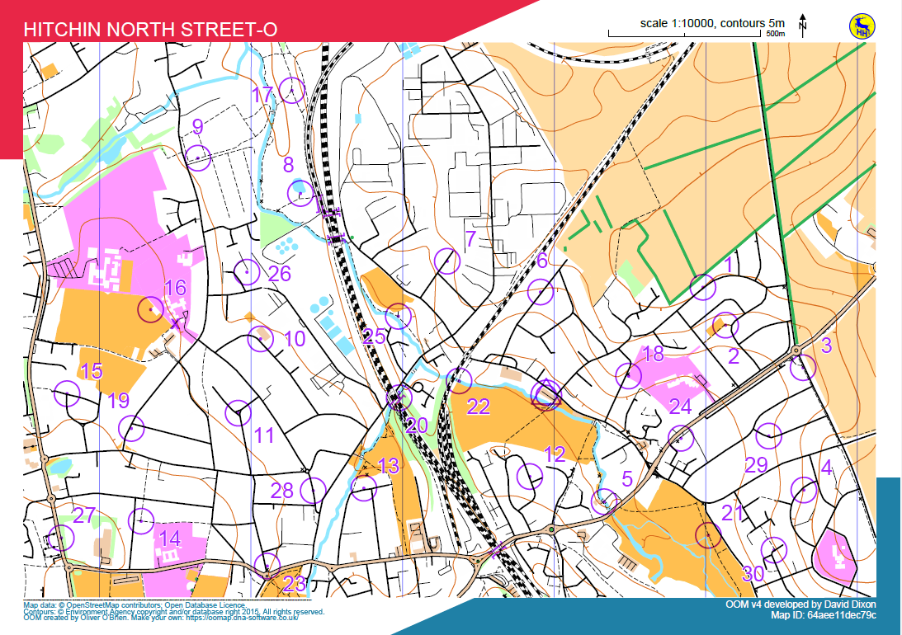

OpenOrienteeringMap
=====

Open OrienteeringMap (oomap) is an online resource for quickly producing orienteering maps and courses, primarily aimed at informal urban score events but also usable for linear courses and more rural areas in some circumstances.  Maps rely on data from OpenStreetMap (https://openstreetmap.org).  Contour data comes from a variety of sources.

The online resource is currently hosted at https://oomap.dna-software.co.uk/ with a backup at https://oomap.ptlnet.com/ and detailed help at https://oomap.dna-software.co.uk/help/

Oomap was conceived by Oliver O'Brien, who developed it up to v3.  David Dixon has built on this to give v4.

v4 of [oomap](https://github.com/oobrien/oomap) has the following main changes from v3:

**Global:**  Mapping data is up-to-date, as required OpenStreetMap data is queried directly when producing the final map.

**Global:** No large mapping databases are required as data is fetched as needed.  This significantly reduces the overhead in running & updating an oomap server.

**Global:**  The standard OpenStreetMap rendering is used at all scales for the web view; map previews can be generated.

**Global:**  Contours are available (60N to 60S) based on NASA SRTM data - a long way from perfect but better than nothing!

**Global:**  Contours are also available worldwide (except Armenia and Azerbaijan) based on ESA COPERNICUS GLO-30 data - should be fresher and a bit better quality than SRTM.

**Global:**  Magnetic North lines are present, and maps are orientated to magnetic North by default.

**Global:**  Controls can be imported from OpenStreetMap nodes - post boxes, lampposts, benches, plaques, permanent orienteering markers or any arbitrary OSM tag.

**Global:**  Linear as well as score courses are possible, with separate start and finish if required.

**Global:**  Easy moving/editing/deleting of individual controls and other overlay features.

**Global:**  Finer-grained control of map output with filters for trees, hedges, fences, walls and drives, and user-defined output resolution.

**UK:**  Higher resolution contours (5m or 10m spacing) are available for most of England, Wales and Northern Ireland, derived from LIDAR data.  Some coverage in Scotland.

**Local:**  LIDAR-based 5m and 10m contours available for France, Belgium, Austria, Luxembourg, population centres in Australia and New Zealand, and a few bits of Ontario, Canada.

**Other changes:**

Unicode text is handled correctly.
Minor rendering changes, including cropping objects to map window (generating smaller PDFs with fewer artefacts), showing building outlines in coloured areas.
Postboxes are now retrieved from OpenStreetMap.

SRTM contour generation requires the helper program phyghtmap from http://katze.tfiu.de/projects/phyghtmap/, along with its dependencies.

Magnetic declination requires geomag from https://github.com/todd-dembrey/geomag

Mapnik stylesheets for OOMap (as used at https://oomap.co.uk/global/ when zoomed in) and other raster tile layers (e.g. the "futurecity" stylesheet is used at https://bikesharemap.com/london/).

The stylesheets are based on the "old" (pre-2012) osm.xml stylesheet at http://svn.openstreetmap.org/applications/rendering/mapnik/osm.xml that used to be used for the "main" map rendering on http://osm.org/

Setup
===

Data
---

You need a PostgreSQL/PostGIS database (I'm using PostgreSQL 10) - with coastline and contour data.  See [README_postgres.md](README_postgre.md) for more details.

Set up a database and tile server, eg. https://www.linuxbabe.com/ubuntu/openstreetmap-tile-server-ubuntu-18-04-osm

Setup of an additional MySQL database for postcode searching and for saved maps is described in [README_mysql.md](README_mysql.md)

Scripts
---

Once the data is ready, Mapnik (including its python bindings) needs to be installed. I'm using mapnik 3.0.24 and python-mapnik built against this version and with pycairo.  Some guidance for setting up Apache with mod_python is available at https://wiki.openstreetmap.org/wiki/Howto_real_time_tiles_rendering_with_mapnik_and_mod_python

Note the futurecity.xml stylesheet requires msttcorefonts  (```sudo apt-get install ttf-mscorefonts-installer```)- & you'll need to let mapnik know where these live, e.g. in the python script:

custom_fonts_dir = '/usr/share/fonts/truetype/msttcorefonts/'

mapnik.register_fonts(custom_fonts_dir)

Website build
---

The website has to be built from the source files in www/oomap.co.uk/ using npm (from node.js install):

1.  Open a command prompt in this directory
2.  run "npm install vite" to install key dependency
3.  run "npm install" to retrieve other required dependencies
4.  run "npm run build" to package up site into the "dist" subdirectory.

Examples
===

The example images, using the XYZ map tile convention, have x=16090, y=10213, z=15. See http://wiki.openstreetmap.org/wiki/Slippy_map_tilenames for further details.

 futurecity

 futurecity_unicode

 streeto

 streeto_norail

 oterrain

 blueprint

 urban_skeleton (not currently on OOMap)
